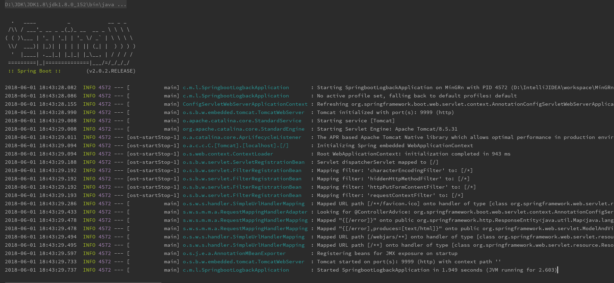
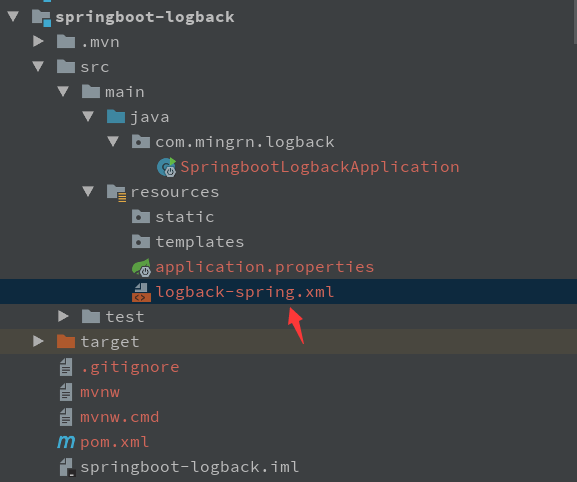
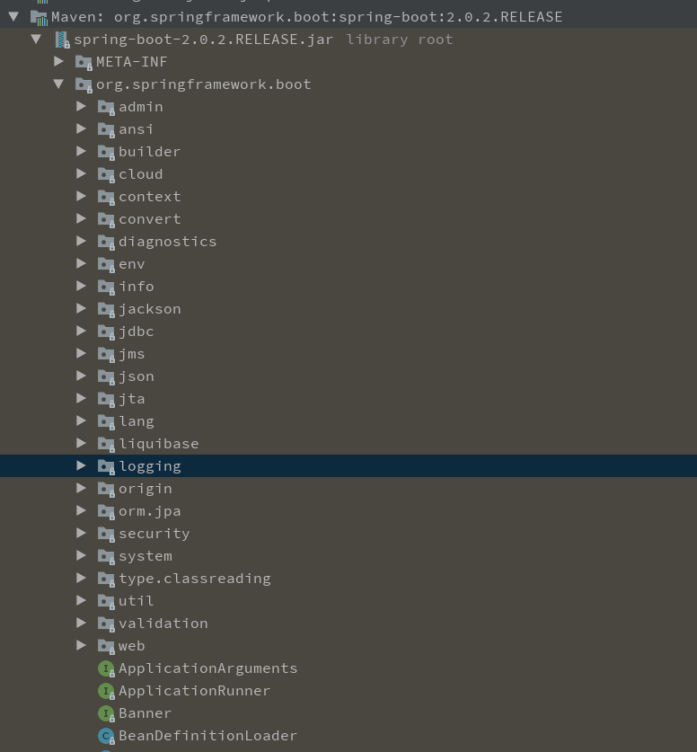

<!-- TOC depthFrom:1 depthTo:6 withLinks:1 updateOnSave:1 orderedList:0 -->

- [Springboot 简介集成logback 日志框架简介](#springboot-简介集成logback-日志框架简介)
- [logback 基本配置](#logback-基本配置)
	- [创建 logback.xml](#创建-logbackxml)
	- [logback 基本属性](#logback-基本属性)
		- [基本示例(仅做参考)](#基本示例仅做参考)
	- [configuration 标签](#configuration-标签)
		- [`scan`](#scan)
		- [`scanPeriod`](#scanperiod)
		- [`packagingData`](#packagingdata)
		- [`debug`](#debug)
	- [statusListener 标签](#statuslistener-标签)
	- [logger 标签](#logger-标签)
		- [`name`](#name)
		- [`level`](#level)
		- [`addtivity`](#addtivity)
	- [root 标签](#root-标签)
	- [appender-ref 标签](#appender-ref-标签)
		- [`ref`](#ref)
	- [contextName 标签](#contextname-标签)
	- [property  标签](#property-标签)
	- [appender 标签](#appender-标签)
	- [appender 组键说明](#appender-组键说明)
		- [`ConsoleAppender`主键](#consoleappender主键)
		- [`FileAppender`组键](#fileappender组键)
		- [`RollingFileAppender`组键](#rollingfileappender组键)
			- [`RollingFileAppender` 组键之 `RollingPolicy`翻转策略](#rollingfileappender-组键之-rollingpolicy翻转策略)
				- [`RollingPolicy` 翻转策略之 `TimeBasedRollingPolicy` 翻转策略](#rollingpolicy-翻转策略之-timebasedrollingpolicy-翻转策略)
				- [`RollingPolicy`翻转策略 之 `FixedWindowRollingPolicy` 翻转策略](#rollingpolicy翻转策略-之-fixedwindowrollingpolicy-翻转策略)
			- [`RollingFileAppender` 组键之 `triggeringPolicy`触发策略](#rollingfileappender-组键之-triggeringpolicy触发策略)
				- [`triggeringPolicy` 触发策略之 `SizeBasedTriggeringPolicy` 触发策略](#triggeringpolicy-触发策略之-sizebasedtriggeringpolicy-触发策略)
		- [`SocketAppender and SSLSocketAppender` 组键](#socketappender-and-sslsocketappender-组键)
			- [`SocketAppender` 组件之`SimpleSocketServer`](#socketappender-组件之simplesocketserver)
			- [`SSLSocketAppender`组件之`SimpleSSLSocketServer`](#sslsocketappender组件之simplesslsocketserver)
		- [`ServerSocketAppender and SSLServerSocketAppender` 组件](#serversocketappender-and-sslserversocketappender-组件)
		- [`SMTPAppender` 组件](#smtpappender-组件)

<!-- /TOC -->


# Springboot 集成logback 日志框架简介

**笔者声明 **该内容参考自 [logback官方网站](https://logback.qos.ch/manual/index.html) 及一 [国外博客](https://springframework.guru/using-logback-spring-boot/) ，其中关于日志写入远程服务器笔者没来得及亲自试，只是将官方文档进行了简单翻译，部分语法拿捏的并不准确。其中每部分都有指出官网的章节地址，建议看不懂的地方直接阅读官网。(未完待续。。。)
> Spring-Boot 作为微服务应用，默认集成 `logback` 日志框架。
> `logback`  是log4j框架的作者开发的新一代日志框架，它效率更高、能够适应诸多的运行环境，同时天然支持SLF4J。
> 
>  **默认logback日志打印效果图**
>
>
>
> 从上图可以看到，日志输出内容元素如下
>  - 时间日期 ：精确到毫秒
>  - 日志级别 ：ERROR, WARN, INFO, DEBUG or TRACE
>  - 进程ID
>  - 分隔符 ：`---` 标识实际日志的开始
>  - 线程名 ：方括号括起来（可能会截断控制台输出
>  - Logger名 ：通常使用源代码的类名 
>
> *正如官网所说*：
>  Assuming the configuration files logback-test.xml or logback.xml are not present, logback will default to invoking BasicConfigurator which will set up a minimal configuration. This minimal configuration consists of a ConsoleAppender attached to the root logger. The output is formatted using a PatternLayoutEncoder set to the pattern %d{HH:mm:ss.SSS} [%thread] %-5level %logger{36} - %msg%n. Moreover, by default the root logger is assigned the DEBUG level.


# logback 基本配置


## 创建 logback.xml

> Spting-Boot 默认集成的 `logback` 虽然打印些日志信息，但是不够友好。满足不了我们日常开发需求。因此，我们可以在g根目录下创建 `logback.xml`  或 `logback-spring.xml` 文件，进行自定义配置
> 
> In a Spring Boot application, you can specify a Logback XML configuration file as logback.xml or logback-spring.xml in the project classpath. The Spring Boot team however recommends using the -spring variant for your logging configuration,   logback-spring.xml is preferred over  logback.xml. If you use the standard logback.xml configuration, Spring Boot may not be able to completely control log initialization.
>
>Here is the code of the `logback-spring.xml` file
>
>
>
> Sping-Boot 默认集成的 `logback`打印的日志样式个人觉得比较喜欢，而且默认打印的日志虽然不足以满足我们日常开发需要。但是我们可以直接在其基础上做些补充修改就能做到我们想要的日志输出，况且如果我们直接自定义日志输出的话想在控制台又想对不同的信息输出不同的颜色信息在进行定义的话也完全是脱裤子放弃多此一举不是？更何况默认Spring-Boot默认就做了这些开箱即用操作，所以我们直接引用进来即可！
> 
> 笔者使用的 SpringBoot 开发版本为 `2.0.2.REALEASE` 版本，所以直接找到 `spring-boot-2.0.2.REALEASE` 依赖包。可以看到该依赖包下 `org.springframework.boot` 包级目录有许多默认配置依赖包类
> 
> 
>
> 当然，这里主要是看 `logging` 包，在该包中有个 `logback` 包，这里这里面放的就是默认 `logback` 日志配置文件。
>
>
>
>其中主要有四个 `xml` 配置文件，我在可以就在我们创建的 `logback-spring.xml` 配置文件中引入 `base.xml` 配置文件。
```xml
<configuration>
	<include resource="org/springframework/boot/logging/logback/base.xml" />
</configuration>
```
> 现在我们重新启动项目就会发现打印的日志信息跟没创建自定义日志配置文件效果是一毛一样。就是因为 `springboot` 默认配置 `logback` 就是该配置文件。
> 
> 现在在来看下 `base.xml` 配置文件中都是些什么东东。
```xml
<included>
	<include resource="org/springframework/boot/logging/logback/defaults.xml" />
	<property name="LOG_FILE" value="${LOG_FILE:-${LOG_PATH:-${LOG_TEMP:-${java.io.tmpdir:-/tmp}}}/spring.log}"/>
	<include resource="org/springframework/boot/logging/logback/console-appender.xml" />
	<include resource="org/springframework/boot/logging/logback/file-appender.xml" />
	<root level="INFO">
		<appender-ref ref="CONSOLE" />
		<appender-ref ref="FILE" />
	</root>
</included>
```
> 其中最惹人瞩目的就是三个 `<include>`
>
 - `defaults.xml`
 - `console-appender.xml`：控制台输出日志信息
 - `file-appender.xml`：日志文件存储
>
> 所以，若是不直接引用 `base.xml` 配置文件，引用另外三个配置文件作用是相同的。建议单独引用文件，且只引用`defaults.xml` 和 `console-appender.xml`。因为多个app部署同一环境下可能会导致日志输出权限问题。


## logback 基本属性

> 现在来看下自定义配置 `logback` 日志输出时需要准守的格式


### 基本示例(仅做参考)
```xml
<configuration debug="true">

	<include resource="org/springframework/boot/logging/logback/defaults.xml" />
	<include resource="org/springframework/boot/logging/logback/console-appender.xml" />

	<property name="APP_NAME" value="Logback"/>
	<property name="APP_HOME" value="/home/logback"/>
	<property name="LOG_HOME_PATH" value="${APP_HOME}/logs"/>
	<property name="DEBUG_LOG_FILE" value="${LOG_HOME_PATH}/debug/${APP_NAME}_debug" />

	<appender name="DEBUG_FILE" class="ch.qos.logback.core.rolling.RollingFileAppender">
		<encoder>
			<pattern>${FILE_LOG_PATTERN}</pattern>
		</encoder>

		<rollingPolicy class="ch.qos.logback.core.rolling.TimeBasedRollingPolicy">
			<FileNamePattern>${DEBUG_LOG_FILE}.%d{yyyy-MM-dd}.log</FileNamePattern>
			<MaxHistory>60</MaxHistory>
		</rollingPolicy>

		<filter class="ch.qos.logback.classic.filter.LevelFilter">
			<level>DEBUG</level>
			<onMatch>ACCEPT</onMatch>
			<onMismatch>DENY</onMismatch>
		</filter>
	</appender>
	<root level="INFO">
		<appender-ref ref="DEBUG_FILE" />
	</root>

	<logger name="com.mingrn.logback" level="DEBUG">
		<appender-ref ref="DEBUG_FILE"/>
	</logger>

	<logger name="com.uhope.rl.logback.repository" level="DEBUG" />
</configuration>
```


## configuration 标签

>  **configuration** 属于全局配置标签，在配置 `logback` 日志时，所有的配置属性都必须包含在该配置标签中！
>  该配置标签共有四个个节点属性
>  

### `scan`

> 默认情况下：配置文件将每分钟扫描一次更改，配置文件如果发生改变，将会被重新加载，默认值为true（[官网说明](https://logback.qos.ch/manual/configuration.html#autoScan)）
```xml
<configuration scan="true"> 
  <!--do something-->
</configuration>
```

### `scanPeriod`

> 配置文件扫描周期，当不设置单位时默认为毫秒级。可以配合 `scan` 使用，当开启 `scan` 时，通过是设置该值用于控制配置文件扫描周期，如每30秒扫描一次配置文件（[官网说明](https://logback.qos.ch/manual/configuration.html#autoScan)）
```xml
<configuration scan="true" scanPeriod="30 seconds" > 
  <!--do something-->
</configuration>
```

###`packagingData`

>在堆栈跟踪中是否启用打包数据，默认false。如设置 TRUE 时打印堆栈数据信息（[官网说明](https://logback.qos.ch/manual/configuration.html#packagingData)）
```xml
<configuration packagingData="true">
  <!--do something-->
</configuration>
```
**日志如下**
```
14:28:48.835 [btpool0-7] INFO  c.q.l.demo.prime.PrimeAction - 99 is not a valid value
java.lang.Exception: 99 is invalid
  at ch.qos.logback.demo.prime.PrimeAction.execute(PrimeAction.java:28) [classes/:na]
  at org.apache.struts.action.RequestProcessor.processActionPerform(RequestProcessor.java:431) [struts-1.2.9.jar:1.2.9]
  at org.apache.struts.action.RequestProcessor.process(RequestProcessor.java:236) [struts-1.2.9.jar:1.2.9]
  at org.apache.struts.action.ActionServlet.doPost(ActionServlet.java:432) [struts-1.2.9.jar:1.2.9]
  at javax.servlet.http.HttpServlet.service(HttpServlet.java:820) [servlet-api-2.5-6.1.12.jar:6.1.12]
  at org.mortbay.jetty.servlet.ServletHolder.handle(ServletHolder.java:502) [jetty-6.1.12.jar:6.1.12]
  at ch.qos.logback.demo.UserServletFilter.doFilter(UserServletFilter.java:44) [classes/:na]
  at org.mortbay.jetty.servlet.ServletHandler$CachedChain.doFilter(ServletHandler.java:1115) [jetty-6.1.12.jar:6.1.12]
  at org.mortbay.jetty.servlet.ServletHandler.handle(ServletHandler.java:361) [jetty-6.1.12.jar:6.1.12]
  at org.mortbay.jetty.webapp.WebAppContext.handle(WebAppContext.java:417) [jetty-6.1.12.jar:6.1.12]
  at org.mortbay.jetty.handler.ContextHandlerCollection.handle(ContextHandlerCollection.java:230) [jetty-6.1.12.jar:6.1.12]
```

### `debug`

> 实时查看logback运行状态，默认值为false。当该值设置为TRUE 时，将打印出logback内部日志信息，实时查看logback运行状态。（[官网说明](https://logback.qos.ch/manual/configuration.html#dumpingStatusData)）
```xml
<configuration debug="true"> 
	<include resource="org/springframework/boot/logging/logback/base.xml" />
</configuration>
```


## statusListener 标签

> `statusListener` configuration 的子元素。是个状态监听器，通过注册状态监听器以便可以立即采取行动响应状态消息，尤其是在logback配置之后发生的消息。在没有人工干预的情况下，注册状态监听器是一种方便的方式来监视logback的内部状态（[官网说明](https://logback.qos.ch/manual/configuration.html#statusListener)）
```xml
<configuration>
  <statusListener class="ch.qos.logback.core.status.OnConsoleStatusListener" />  

  <!--do something-->
</configuration>
```


## logger 标签

> `<logger>` configuration 的子元素。用来设置某个包或及具体的某个类的日志输出以及指定 `<appender>` , `logger` 只用一个 name 、`level` 和一个可选的 `addtivity` 属性（[官网说明](https://logback.qos.ch/manual/configuration.html#loggerElement)）

### `name`

> `name` 属性用来指定 `logger` 约束的包或具体类。
```xml
<!--指定包-->
<logger name="com.mingrn.repository"/>
<!--指定类-->
<logger name="com.mingrn.repository.UserRepository"/>
```

### `level`

> `level` 属性设置日志打印级别。TRACE,、DEBUG、 INFO、 WARN、 ERROR、 ALL 和 OFF，还有一个特俗值 INHERITED 或者同义词 NULL，代表强制执行上级的级别。如果未设置此属性，那么当前 logger 将会继承上级的级别（root）
```xml
<!--指定包-->
<logger name="com.mingrn.repository" level="DEBUG"/>
<!--指定类-->
<logger name="com.mingrn.repository.UserRepository" level="DEBUG"/>
```

### `addtivity`

> `addtivity` 是否向上级loger传递打印信息，默认是true。及若这里设置 true
```xml
<logger name="com.mingrn.repository" level="DEBUG" additivity="true"/>
```
> 在输出日志时，你会发现控制台会输出两边，就是因为设置了该属性。所以一般指定  `<logger>` 指定包或具体类时该属性设置为 FALSE。
```xml
<logger name="com.mingrn.repository" level="DEBUG" additivity="true"/>
	
<root level="INFO">
    <appender-ref ref="CONSOLE" />
	<appender-ref ref="DEBUG_FILE" />
	<appender-ref ref="INFO_FILE" />
	<appender-ref ref="WARN_FILE" />
	<appender-ref ref="ERROR_FILE" />
	<appender-ref ref="RUN_FILE" />
</root>
```


## root 标签

> `<root>`configuration 的子元素。该标签其实就是 `<logger>` ，但他是根 `<logger>`。该标签只有一个属性 `level` 即打印日志级别。若 `<logger >` 或  `<appender>` 标签为设置输出级别时就会默认继承该标签设置的级别！同时，若设置 `<logger >` 后并且 `additivity` 设置值为 true 时就会进行传递导致 logger 打印日志后 root 又打印一次日志！（[官网说明](https://logback.qos.ch/manual/configuration.html#rootElement)）


## appender-ref 标签

> `<appender-ref>` root 或 logger 的子元素。标签属于 `logger` 和 `root`内部引用标签。该标签只有一个属性 `ref` 用于指定 `<appender>` 标签的 `name` 值！就是说被指定的 `appender` 输出级别为 `root`、`logger` 指定的级别，若 `appender` 指定级别后只输出 `appender` 指定的级别日志。
```xml
<root level="INFO">
    <appender-ref ref="CONSOLE" />
	<appender-ref ref="DEBUG_FILE" />
	<appender-ref ref="INFO_FILE" />
	<appender-ref ref="WARN_FILE" />
	<appender-ref ref="ERROR_FILE" />
	<appender-ref ref="RUN_FILE" />
</root>

<logger name="com.uhope.rl.electornic" level="DEBUG">
	<appender-ref ref="DEBUG_FILE"/>
</logger>
```


### `ref`

> 指定具体的 `appender`。`ref` 值为 `<appender>` 的 `name` 属性值
```xml
<logger name="com.uhope.rl.electornic" level="DEBUG">
	<appender-ref ref="DEBUG_FILE"/>
</logger>
<appender name="DEBUG_FILE" class="ch.qos.logback.core.rolling.RollingFileAppender">
	<!--do something-->
</appender>
```

## contextName 标签
> `<contextName>`  ：configuration 的子元素。用于定义 looger 关联到的上下文，默认上下文名称为 default。但是可以通过该标签设置成其他名称，用于区分不同引用程序的记录，一旦设置，不能修改。
> 
> [官网说明](https://logback.qos.ch/manual/configuration.html#contextName)
```xml
<configuration>
  <contextName>myAppName</contextName>
  <appender name="STDOUT" class="ch.qos.logback.core.ConsoleAppender">
    <encoder>
      <pattern>%d %contextName [%t] %level %logger{36} - %msg%n</pattern>
    </encoder>
  </appender>

  <root level="debug">
    <appender-ref ref="STDOUT" />
  </root>
</configuration>
```


## property  标签

> `<property>` configuration 的子元素。 是个属性标签 。
>
>[官网说明](https://logback.qos.ch/manual/configuration.html#variableSubstitution)
>
> **值定义**
```xml
<configuration debug="true">
	<!--路径-->
	<property name="USER_HOME" value="/home/sebastien" />
	<!--日志输出规则-->
	<property name="FILE_LOG_PATTERN" value="%d{yyyy-MM-dd HH:mm:ss.SSS} ${LOG_LEVEL_PATTERN:-%5p} ${PID:- } --- [%t] %-40.40logger{39} : %m%n${LOG_EXCEPTION_CONVERSION_WORD:-%wEx}" />

	<appender name="FILE" class="ch.qos.logback.core.FileAppender">
		<file>${USER_HOME}/myApp.log</file>
		<encoder>
			<pattern>%msg%n</pattern>
		</encoder>
	</appender>

	<appender name="ERROR_FILE" class="ch.qos.logback.core.rolling.RollingFileAppender">
		<encoder>
			<pattern>${FILE_LOG_PATTERN}</pattern>
		</encoder>
	</appender>
</configuration>
```
> **引用资源**
```xml
<configuration>

  <property resource="resource.properties" />

  <appender name="FILE" class="ch.qos.logback.core.FileAppender">
     <file>${USER_HOME}/myApp.log</file>
     <encoder>
       <pattern>%msg%n</pattern>
     </encoder>
   </appender>

   <root level="debug">
     <appender-ref ref="FILE" />
   </root>
</configuration>
```
>**引用文件**
>
> variables.properties 是个文件
> 
> 文件内容：
> `USER_HOME=/home/sebastien`
```xml
<configuration>

  <property file="src/main/java/chapters/configuration/variables.properties" />

  <appender name="FILE" class="ch.qos.logback.core.FileAppender">
     <file>${USER_HOME}/myApp.log</file>
     <encoder>
       <pattern>%msg%n</pattern>
     </encoder>
   </appender>

   <root level="debug">
     <appender-ref ref="FILE" />
   </root>
</configuration>
```


## appender 标签

> `appender` configuration 的子元素。它其实也是一种 `logger` ，不过它是一个负责写日志的组件。该组件强制使用两个 属性值 ：`name` 和 `class`。
>  - `name` ：appender 的名称，该值主要用于 `<appender-ref>` 的 `ref`。
>  - `class`：定义appender 的权限定名或叫组件！


## appender 组键说明


> appender 的组键主要指的是 appender 标签 class 引用的包类
>  组件分为另种，一种是记录本地，一种是记录到远程。
>  - 本地 如：`ConsoleAppender`、`FileAppender`...
>  - 远程 如：`SocketAppender `、`SSLSocketAppender`

### `ConsoleAppender`主键

>[ConsoleAppender官网说明](https://logback.qos.ch/manual/appenders.html#ConsoleAppender)
>
> ConsoleAppender 组件包类：`ch.qos.logback.core.ConsoleAppender`
> ConsoleAppender  主要作用是将日志输出到控制台，适用于**本地**。
> 
> <u>有以下节点属性</u>
> 
| 属性名	| 类型	| 说明	|
|:------|------:|:-----:|
|encoder|Encoder|[编码](https://logback.qos.ch/manual/encoders.html)|
|target |String | System.out 或者 System.err ，默认 System.out|
|withJansi |boolean |默认的jansi属性设置为false。设置Jansi到true会激活Jansi库，它为Windows机器上的ANSI颜色代码提供支持。|

```xml
<configuration>

  <appender name="STDOUT" class="ch.qos.logback.core.ConsoleAppender">
    <!-- encoders are assigned the type -->
    <!-- ch.qos.logback.classic.encoder.PatternLayoutEncoder by default -->
    <encoder>
      <pattern>%-4relative [%thread] %-5level %logger{35} - %msg %n</pattern>
    </encoder>
  </appender>

  <root level="DEBUG">
    <appender-ref ref="STDOUT" />
  </root>
</configuration>
```

### `FileAppender`组键

> [FileAppender官网说明](https://logback.qos.ch/manual/appenders.html#FileAppender)
>
> FileAppender 组件包类 `ch.qos.logback.core.FileAppender`
> FileAppender  主要作用是将日志写入一个文件中。目标文件由文件选项指定。如果文件已经存在，它要么被追加，要么根据附加属性的值被截断，适用于**本地**。
>
> <u>有以下节点属性</u>
| 属性名	| 类型	| 说明	|
|:------|------:|:-----:|
|file   |String |被写入的文件名，可以是相对目录，也可以是绝对目录，如果上级目录不存在会自动创建，没有默认值。|
|append |boolean|如果设为true，日志将会在文件结尾处增加。如果为false就清空现有文件。默认为true|
|encoder|String |[编码](https://logback.qos.ch/manual/encoders.html)|
|prudent|boolean|将日志安全谨慎的写入到指定文件，即使有其他FileAppender也将日志写入此文件中。效率低下，该模式默认值为false。注意：当该值设为true时，append将默认为true|
> **说明**
> 默认情况下，日志会立即写入到底层输出流。这种默认方式是安全的，因为如果应用程序没有正确关闭的情况下退出，name日志不会丢失。不过，为了显著的增加日志吞吐量应该将 `<immediateFlush>` 显示的设为false。
```xml
<configuration>

  <appender name="FILE" class="ch.qos.logback.core.FileAppender">
    <file>testFile.log</file>
    <append>true</append>
    <!-- 为了更高的日志吞吐量应将 immediateFlush 设为 false -->
    <immediateFlush>true</immediateFlush>
    <!-- encoders are assigned the type -->
    <!-- ch.qos.logback.classic.encoder.PatternLayoutEncoder by default -->
    <encoder>
      <pattern>%-4relative [%thread] %-5level %logger{35} - %msg%n</pattern>
    </encoder>
  </appender>
        
  <root level="DEBUG">
    <appender-ref ref="FILE" />
  </root>
</configuration>
```

### `RollingFileAppender`组键

> [RollingFileAppender官网说明](https://logback.qos.ch/manual/appenders.html#RollingFileAppender)
> 
> RollingFileAppender 组件包类 `ch.qos.logback.core.rolling.RollingFileAppender`
> RollingFileAppender 继承 FileAppender。当满足一定条件时，具有滚动写入文件的特性。说以这是最常用的写入文件权限定名，适用于**本地**。
> 该组件具有两个非常重要的组件 ：`RollingPolicy` 和 `TriggeringPolicy`
>
> <u>有以下节点属性</u>
|属性名	|类型	|说明	|
|:------|------:|:-----:|
|file	|String |被写入的文件名，可以是相对目录，也可以是绝对目录，如果上级目录不存在会自动创建，没有默认值。|
|append |boolean|如果设为true，日志将会在文件结尾处增加。如果为false就清空现有文件。默认为true|
|encoder|String |[编码](https://logback.qos.ch/manual/encoders.html)|
|prudent|boolean|将日志安全谨慎的写入到指定文件，即使有其他FileAppender也将日志写入此文件中。效率低下，该模式默认值为false。注意：当该值设为true时，append将默认为true|
|rollingPolicy |RollingPolicy |滚动出发策略，当发生滚动时，决定 RollingFileAppender 的行为，涉及文件移动和重命名。**见下文**|
|triggeringPolicy |TriggeringPolicy |告知 RollingFileAppender 合适激活滚动。**见下文**|

#### `RollingFileAppender` 组键之 `RollingPolicy`翻转策略

>  [RollingPolicy官网说明](https://logback.qos.ch/manual/appenders.html#onRollingPolicies)
>
> RollingPolicy 滚动策略负责翻转过程中的文件路径与重命名或命名。
> 
>

##### `RollingPolicy` 翻转策略之 `TimeBasedRollingPolicy` 翻转策略
>  TimeBasedRollingPolicy 包类 `ch.qos.logback.core.rolling.TimeBasedRollingPolicy`
>  TimeBasedRollingPolicy 翻转策略可能是最最流行的翻转策略。它定义了基于时间的翻转策略，如日、月等！
>  TimeBasedRollingPolicy 有一个强制性的属性 `<fileNamePattern>` 和 几个非必须的属性。
>
> <u>有以下节点属性</u>
|属性名 |类型 |说明|
|:-----|---:|:--:|
|fileNamePattern |String |**必须属性**，它的值应该包括文件的名称，以及适当放置的%d转换说明符。%d转换说明符可以包含一个由`java.text.SimpleDateFormat`指定的日期和时间模式,如%d{yyyy-MM}。如果省略了日期和时间模式 如%d，则默认时间格式为 yyyy-MM-dd。翻转周期是从 fileNamePattern 值中推断出来的。|
|maxHistory |int |日志数量最大保存时间，如设置的时间模式(`fileNamePattern`)为 yyyy-MM，maxHistory 设为 6。则意味日志文件最大保存6个月。注意，当旧的归档日志文件被删除时，为了日志文件存档而创建的任何文件夹都将被适当地删除。|
|maxFileSize |int |每个文件最大保存大小，如 10M，100M |
|totalSizeCap |int |控制日志文档存储的总大，如 3GB、100M|
|cleanHistoryOnStart |boolean |通过将清理历史记录设置为true，在appender启动时执行存档删除操作。默认false|
> TimeBasedRollingPolicy fileNamePattern 值列举：
|fileNamePattern |Rollover schedule |file |
|:---------------|-----------------:|:------:|
|/wombat/foo.%d  |默认：yyyy-MM-dd 每天滚动|/wombat/foo.2018-6-1、 /wombat/foo.2018-6-2|
|/wombat/%d{yyyy/MM}/foo.txt |每月滚动 |/wombat/2018/1/foo.txt 、/wombat/2018/2/foo.txt|
|/wombat/foo.%d{yyyy-ww}.log |每周滚动 | |
|/wombat/foo%d{yyyy-MM-dd_HH}.log |每时滚动 | |
|/wombat/foo%d{yyyy-MM-dd_HH-mm}.log |每分滚动 | |
|/wombat/foo.%d.gz |每日滚动，自动压缩为 GZIP格式 |/wombat/foo.2018-6-1.gz |

>  设置日志保存最大时间和最大容量 ` <file>logFile.log</file>` 可以不设
```xml
<configuration>
  <appender name="FILE" class="ch.qos.logback.core.rolling.RollingFileAppender">
  
    <file>logFile.log</file>
    
    <encoder>
      <pattern>%-4relative [%thread] %-5level %logger{35} - %msg%n</pattern>
    </encoder>
    
    <rollingPolicy class="ch.qos.logback.core.rolling.TimeBasedRollingPolicy">
      <!-- daily rollover -->
      <fileNamePattern>logFile.%d{yyyy-MM-dd}.log</fileNamePattern>

      <!-- keep 30 days' worth of history capped at 3GB total size -->
      <maxHistory>30</maxHistory>
      <totalSizeCap>3GB</totalSizeCap>

    </rollingPolicy>
  </appender> 

  <root level="DEBUG">
    <appender-ref ref="FILE" />
  </root>
  
</configuration>
```
> 允许多程序写入同一日志文件
```xml
<configuration>
  <appender name="FILE" class="ch.qos.logback.core.rolling.RollingFileAppender">
    <!-- Support multiple-JVM writing to the same log file -->
    <prudent>true</prudent>
    <rollingPolicy class="ch.qos.logback.core.rolling.TimeBasedRollingPolicy">
      <fileNamePattern>logFile.%d{yyyy-MM-dd}.log</fileNamePattern>
      <maxHistory>30</maxHistory> 
      <totalSizeCap>3GB</totalSizeCap>
    </rollingPolicy>

    <encoder>
      <pattern>%-4relative [%thread] %-5level %logger{35} - %msg%n</pattern>
    </encoder>
  </appender> 

  <root level="DEBUG">
    <appender-ref ref="FILE" />
  </root>
</configuration>
```
> 设置每个文件保存最大大小
```xml
<configuration>
  <appender name="ROLLING" class="ch.qos.logback.core.rolling.RollingFileAppender">
    <file>mylog.txt</file>
    <rollingPolicy class="ch.qos.logback.core.rolling.SizeAndTimeBasedRollingPolicy">
      <!-- rollover daily -->
      <fileNamePattern>mylog-%d{yyyy-MM-dd}.%i.txt</fileNamePattern>
       <!-- each file should be at most 100MB, keep 60 days worth of history, but at most 20GB -->
       <maxFileSize>100MB</maxFileSize>    
       <maxHistory>60</maxHistory>
       <totalSizeCap>20GB</totalSizeCap>
    </rollingPolicy>
    <encoder>
      <pattern>%msg%n</pattern>
    </encoder>
  </appender>

  <root level="DEBUG">
    <appender-ref ref="ROLLING" />
  </root>

</configuration>
```

##### `RollingPolicy`翻转策略 之 `FixedWindowRollingPolicy` 翻转策略
>  FixedWindowRollingPolicy包类 `ch.qos.logback.core.rolling.FixedWindowRollingPolicy`
>  FixedWindowRollingPolicy在滚动时，根据一个固定的窗口算法，FixedWindowRollingPolicy重命名文件
>  FixedWindowRollingPolicy有一个强制性的属性 `<fileNamePattern>` 和 几个非必须的属性。
>  
> <u>有以下节点属性</u>
|属性名 |类型 |说明|
|:-----|---:|:--:|
|fileNamePattern |String |**必须属性**，这个选项表示在重命名日志文件时将遵循FixedWindowRollingPolicy的模式。它必须包含字符串%i，它将指示插入当前窗口索引值的位置。如 MyLogFile%i.log 用最小索引1和最大索引3将产生文件 MyLogFile1.log、MyLogFile2.log 和 MyLogFile3.log|
|minIndex |int |最小索引 |
|maxIndex |int |最大索引 |

> TimeBasedRollingPolicy fileNamePattern 值列举
|Number of rollovers |Active output target |Archived log files |file |
:-----|---:|:--:|
|0 | foo.log| - | 没有翻转文件，日志将会记录初始文件|
|1 | foo.log| foo1.log| 第一次翻转，文件foo.log 将会被命名为foo1.log，新文件 foo.log 将会被创建并成为活动输出目标。|
|2 | foo.log| foo1.log、foo2.log| 第二次翻转，文件foo1.log 将会被命名为foo2.log，文件foo.log 将会被命名为foo1.log，新文件 foo.log 将会被创建并成为活动输出目标。| 同上 |
|3 | foo.log| foo1.log、foo2.log、foo3.log| 同上 |
|4 | foo.log| foo1.log、foo2.log、foo3.log、foo4.log| 同上 |

```xml
<configuration>
  <appender name="FILE" class="ch.qos.logback.core.rolling.RollingFileAppender">
    <file>test.log</file>

    <rollingPolicy class="ch.qos.logback.core.rolling.FixedWindowRollingPolicy">
      <fileNamePattern>tests.%i.log.zip</fileNamePattern>
      <minIndex>1</minIndex>
      <maxIndex>3</maxIndex>
    </rollingPolicy>

    <triggeringPolicy class="ch.qos.logback.core.rolling.SizeBasedTriggeringPolicy">
      <maxFileSize>5MB</maxFileSize>
    </triggeringPolicy>
    <encoder>
      <pattern>%-4relative [%thread] %-5level %logger{35} - %msg%n</pattern>
    </encoder>
  </appender>
        
  <root level="DEBUG">
    <appender-ref ref="FILE" />
  </root>
</configuration>
```

#### `RollingFileAppender` 组键之 `triggeringPolicy`触发策略

>  [triggeringPolicy官网说明](https://logback.qos.ch/manual/appenders.html#TriggeringPolicy)
>
> RollingPolicy 触发策略实现负责指导RollingFileAppender在何时翻转。
> 

##### `triggeringPolicy` 触发策略之 `SizeBasedTriggeringPolicy` 触发策略
> [SizeBasedTriggeringPolicy触发策略官网说明](https://logback.qos.ch/manual/appenders.html#SizeBasedTriggeringPolicy)
> 
>  SizeBasedTriggeringPolicy 包类 `ch.qos.logback.core.rolling.SizeBasedTriggeringPolicy`
>  SizeBasedTriggeringPolicy 查看当前活动文件的大小，如果超过指定大小会告知 RollingFileAppender 触发当前活动文件滚动。
>  SizeBasedTriggeringPolicy 触发策略只接受一个属性 `maxFileSize`，默认值为10 MB。
>  `maxFileSize `选项可以用字节、千字节、兆字节或千兆字节来指定，方法是用KB、MB和GB分别设置数值。例如，5000000，5000 KB，5 MB和2 GB都是有效值，前三个是等价的。
```xml
<configuration>
  <appender name="FILE" class="ch.qos.logback.core.rolling.RollingFileAppender">
    <file>test.log</file>
    <rollingPolicy class="ch.qos.logback.core.rolling.FixedWindowRollingPolicy">
      <fileNamePattern>test.%i.log.zip</fileNamePattern>
      <minIndex>1</minIndex>
      <maxIndex>3</maxIndex>
    </rollingPolicy>

    <triggeringPolicy class="ch.qos.logback.core.rolling.SizeBasedTriggeringPolicy">
      <maxFileSize>5MB</maxFileSize>
    </triggeringPolicy>
    <encoder>
      <pattern>%-4relative [%thread] %-5level %logger{35} - %msg%n</pattern>
    </encoder>
  </appender>
        
  <root level="DEBUG">
    <appender-ref ref="FILE" />
  </root>
</configuration>
```

### `SocketAppender and SSLSocketAppender` 组键

> [ SocketAppender and SSLSocketAppender官网说明](https://logback.qos.ch/manual/appenders.html#SocketAppender)
>
> SocketAppender 包类 `ch.qos.logback.classic.net.SocketAppender`
> SSLSocketAppender  包类 `ch.qos.logback.classic.net.SSLSocketAppender`
> 
> **下方译文仅供参考，详细清阅读官网说明**
> 
> SocketAppender  和 SSLSocketAppender  权限定名主要适用于远程。前面讲的权限定名主要是将日志记录在当前服务器本地机器中。而 SocketAppender 和 SSLSocketAppender  权限定名则能完美的将日志写入远程机器中。
>
> SocketAppender  能将日志写到远程机器上主要得力于 SocketAppender  被涉及为通过在线路上传输序列化的*日志事件*体(这里不知道说)实体。当在线路上使用 SocketAppender  时日志事件会在 clear 中进行发送。不过，当我们使用 SSLSocketAppender 时，日志将会在安全通道中进行发送。
> 序列化的实体类型是 [LoggingEventVO](https://logback.qos.ch/xref/ch/qos/logback/classic/spi/LoggingEventVO.html)，它实现了 `ILoggingEvent` 接口。
> 
> 不过，就日志事件而言，通过远程记录日志是非法入侵的，在反序列化的接收端事件可以被记录，就如它本地生成的一样。在不同的机器上运行的多个SocketAppender实例可以将它们的日志输出引导到中央日志服务器，后者的格式是固定的。SocketAppender不采用相关联的布局，因为它将序列化的事件发送到远程服务器。
> 
> SocketAppender在传输控制协议（TCP）层之上运行，它提供了一个可靠的、有序的、流控制的端到端octet流。因此，如果远程服务器是可访问的，那么日志事件最终将到达那里。否则，如果远程服务器宕机或无法访问，日志事件将被简单地删除。如果服务器重新启动，则事件传输将被透明地恢复。这种透明的重新连接是由一个连接器线程执行的，它定期尝试连接到服务器。
>
>日志事件由本机TCP实现自动缓冲。这意味着，如果与服务器的连接速度较慢，但仍然比客户机的事件生成速度快，那么客户机就不会受到慢网络连接的影响。但是，如果网络连接速度比事件生成速率慢，那么客户端只能在网络速率上取得进展。
>
>尤其在极端情况下，网络连接到服务器的情况下，客户端最终会被阻塞。或者，如果网络链接在上升，但是服务器宕机了，客户端将不会被阻塞，尽管由于服务器不可用，日志事件将会丢失。即使一个SocketAppender不再连接到任何记录器，也不会在连接器线程的存在中被垃圾收集。只有当连接到服务器的连接被关闭时，连接器线程才会存在。
>
>为了避免这个垃圾收集问题，应该显式关闭SocketAppender。长时间的应用程序创建、销毁许多SocketAppender实例应该注意这个垃圾收集问题。大多数其他应用程序可以安全地忽略它。如果承载SocketAppender的JVM在SocketAppender关闭之前退出，无论是显式的还是随后的垃圾收集，那么管道中可能会丢失未传输的数据。这是基于Windows系统的常见问题。
>
>为了避免丢失的数据，通常在退出应用程序之前，可以显式地关闭 socketAppender，或者通过调用红上下文的 stop 方法。
>
>远程服务器由remoteHost和port properties标识。SocketAppender 属性列在下面的表中。SSLSocketAppender支持许多额外的配置属性，后面详细介绍。
>
> <u>有以下节点属性</u>
|属性名	|类型	|说明	|
|:------|------:|:-----:|
|port |int |远程服务器端口 |
|remoteHost |String |远程服务器名 |
|ssl |SSLConfiguration |仅支持SSLSocketAppender，该属性提供了将由appender使用的SSL配置，参见：[官网SSL所述](https://logback.qos.ch/manual/usingSSL.html) |
|includeCallerData |boolean |如果为true，那么调用者的数据将对远程主机可用。默认情况下，没有发送给服务器的调用者数据|
|reconnectionDelay |[Duration](https://logback.qos.ch/apidocs/ch/qos/logback/core/util/Duration.html) |持续时间延迟字符串，如 `10 seconds` 表示在每次失败的连接尝试到服务器之间等待的时间。这个选项的默认值是30秒。将这个选项设置为0关闭了重新连接功能。注意，如果成功连接到服务器，就不会出现连接器线程。|
|queueSize |int |**大于0的整数**表示要保留给远程接收者的日志事件的数量。当队列大小为1时，对远程接收器的事件传递是同步的。当队列的size大于1时，如果列中有可用空间，则会排队新事件。使用大于1的队列长度可以通过消除由临时网络延迟引起的延迟来提高性能。参考 `eventDelayLimit` 属性|
|eventDelayLimit |[Duration](https://logback.qos.ch/apidocs/ch/qos/logback/core/util/Duration.html) |持续时间字符串，比如 `10 seconds`。它表示在删除事件之前等待的时间，以防本地队列满了，也就是说已经包含排队事件。如果远程主机持续缓慢地接受事件，可能会发生这种情况。这个选项的默认值是100毫秒。|

> *日志服务器选项*
> 
> 标准的Logback经典发行版包括两个可用于从 SocketAppender 或 SSLSocketAppender 接收日志事件的服务器
> - `ServerSocketReceiver `
> - `SimpleSocketServer `
>

#### `SocketAppender` 组件之`SimpleSocketServer` 
> [SimpleSocketServer 官网说明](https://logback.qos.ch/manual/appenders.html#simpleSocketServer)
> 
> SimpleSocketServer应用程序接受两个命令行参数：`port` 和 `configFile`
> 端口是要监听的端口，`configFile`是 XML 格式的配置脚本。
```xml
<configuration>
          
  <appender name="SOCKET" class="ch.qos.logback.classic.net.SocketAppender">
    <remoteHost>${host}</remoteHost>
    <port>${port}</port>
    <reconnectionDelay>10000</reconnectionDelay>
    <includeCallerData>${includeCallerData}</includeCallerData>
  </appender>

  <root level="DEBUG">
    <appender-ref ref="SOCKET" />
  </root>  

</configuration>
```

#### `SSLSocketAppender`组件之`SimpleSSLSocketServer`
> [SimpleSSLSocketServer官网说明](https://logback.qos.ch/manual/appenders.html#simpleSSLSocketServer)
>
> SimpleSSLSocketServer要求SimpleSocketServer使用的端口和configFile命令行参数相同。另外，您必须使用命令行中指定的系统属性来提供日志服务器的x.509证书的位置和密码。
> 
> 服务器配置有debug="true"，在根元素上指定，可以在在服务器的启动日志中看到将要使用的SSL配置。这有助于验证本地安全策略是否得到了正确的实施！
```xml
<configuration debug="true">
          
  <appender name="SOCKET" class="ch.qos.logback.classic.net.SSLSocketAppender">
    <remoteHost>${host}</remoteHost>
    <port>${port}</port>
    <reconnectionDelay>10000</reconnectionDelay>
    <ssl>
      <trustStore>
        <location>${truststore}</location>
        <password>${password}</password>
      </trustStore>
    </ssl>
  </appender>

  <root level="DEBUG">
    <appender-ref ref="SOCKET" />
  </root>  

</configuration>	
```


### `ServerSocketAppender and SSLServerSocketAppender` 组件

> [ServerSocketAppender and SSLServerSocketAppender官网说明](https://logback.qos.ch/manual/appenders.html#serverSocketAppender)

> ServerSocketAppender 包类  `ch.qos.logback.classic.net.server.ServerSocketAppender`
> SSLServerSocketAppender 包类 `ch.qos.logback.classic.net.server.SSLServerSocketAppender`

> `SocketAppender` 和 `SSLSocketAppender` 组件是为了让应用程序通过网络连接到远程日志服务器，目的是向服务器交付日志事件。在某些情况下，让应用程序启动到远程日志服务器的连接可能不方便或不可行。对于这些情况，Logback提供了`ServerSocketAppender `
> 
> - ServerSocketAppender：被动地监听TCP套接字，等待来自远程客户端的连接。日志事件被分发给每个连接的客户端。当没有客户端连接时发生的日志事件被立即丢弃
> - SSLSocketAppender：使用一个安全的加密通道将日志事件分发给每个连接的客户端。此外，启用ssl的appender完全支持基于证书的认证，这可以用来确保只有经过授权的客户端才能连接到appender以接收伐木事件。
> 
> <u>ServerSocketAppender、SSLServerSocketAppender 有一下节点属性</u>
|属性名	|类型	|说明	|
|:------|------:|:-----:|
|address|String |应用程序将监听的本地网络接口地址。如果没有指定该属性，appender将侦听所有网络接口。|
|port |int |应用程序监听的端口 |
|includeCallerData |boolean | 如果为true时调用者数据将对远程主机可用。默认情况下，没有发送给客户端的调用者数据|
|ssl |SSLConfiguration |仅支持`SSLServerSocketAppender`组件，这个属性提供了将由appender使用的SSL配置 |

> **ServerSocketAppender组件 示例**
```xml
<configuration debug="true">
  <appender name="SERVER" class="ch.qos.logback.classic.net.server.ServerSocketAppender">
    <port>${port}</port>
    <includeCallerData>${includeCallerData}</includeCallerData>
  </appender>

  <root level="debug">
    <appender-ref ref="SERVER" />
  </root>  

</configuration>
```
> 注意：在没有remoteHost属性的情况下——这个appender被动地等待来自远程主机的入站连接，而不是打开到远程日志服务器的连接。

> **SSLServerSocketAppender 组件示例**
```xml
<configuration debug="true">
  <appender name="SERVER" class="ch.qos.logback.classic.net.server.SSLServerSocketAppender">
    <port>${port}</port>
    <includeCallerData>${includeCallerData}</includeCallerData>
    <ssl>
      <keyStore>
        <location>${keystore}</location>
        <password>${password}</password>
      </keyStore>
    </ssl>
  </appender>

  <root level="debug">
    <appender-ref ref="SERVER" />
  </root>  

</configuration>
```


### `SMTPAppender` 组件

> [SMTPAppender官网说明](https://logback.qos.ch/manual/appenders.html#SMTPAppender)