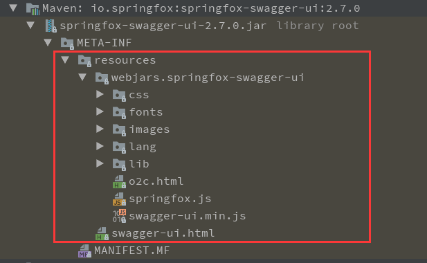
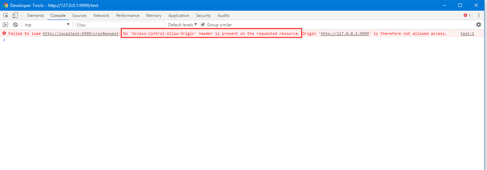
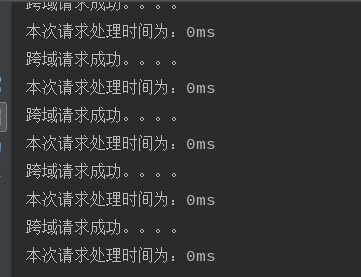

<!-- TOC depthFrom:1 depthTo:6 withLinks:1 updateOnSave:1 orderedList:0 -->

+ [说明](#说明)
	- [WebMvnConfig 配置类](#webmvnconfig-配置类)
	- [pom依赖(主要)](#pom依赖主要)
	- [视图配置](#视图配置)
	- [静态资源访问](#静态资源访问)
	- [全局异常处理](#全局异常处理)
	- [跨域请求访问](#跨域请求访问)

<!-- /TOC -->

### 说明
> springboot-mvc 是 spingboot 集成 MVC 练习配置项目，采用的是 `freemarker` 模板引擎(至于
为什么不使用 `thymeleaf` 作为模板引擎完全是个人习惯)。其中在配置过程中踩了不少坑，也翻阅了不少资
料。因此特记录下来遇到的问题，方便以后翻阅

#### WebMvnConfig 配置类
> 该类继承 `WebMvcConfigurationSupport` ,虽然继承 `WebMvcConfigurerAdapter ` 类也可以
配置MVC。但是 `WebMvcConfigurationSupport` 的配置更全， `WebMvcConfigurerAdapter` 有
的他都有!而且在该项目中采用的 SpringBoot 版本是 2.0+ ,`WebMvcConfigurerAdapter` 已经过时
了最好实现 `WebMvcConfigurer` 重写其中的接口!
> ```java
>  @EnableWebMvc
>  public class WebMvcConfig implements WebMvcConfigurer {
>
>  }
>
>  @Configuration
>  public class WebMvcConfig extends WebMvcConfigurationSupport {
>
>  }
>
>  @Configuration
>  public class WebMvcConfig extends DelegatingWebMvcConfiguration {
>
>  }
>```
> 上面代码中需要在类中实现关于WebMvcAutoConfiguration的配置,而不是在application.properties中。
> - 详见: [博客园](https://www.cnblogs.com/sufferingStriver/p/9026764.html?_blank)

####  pom依赖(主要)
```xml
<dependency>
    <groupId>org.springframework.boot</groupId>
    <artifactId>spring-boot-starter-freemarker</artifactId>
</dependency>
```

#### 视图配置
```java
    @Bean
    public ViewResolver viewResolver(){
        FreeMarkerViewResolver resolver = new FreeMarkerViewResolver();
        resolver.setSuffix(VIEW_SUFFIX);
        resolver.setContentType(VIEW_CONTENT_TYPE);
        return resolver;
    }
```

> 不配置 `resolver.setPrefix(VIEW_PREFIX);` 的原因是这里使用的是 `Freemarker` 模板引擎，
> `freemarker` 本身配置了 `templateLoaderPath` 而在 `viewResolver` 中不需要配置 `prefix`，
> 且路径前缀必须配置在 `templateLoaderPath` 中, 即在 `application.properties` 配置文件中配置
> 的 `spring.freemarker.template-loader-path=classpath:/temp`
> 注意的是，SpringBoot 默认模板访问路径是
>
>   > - `/resource/templates` 模板资源
>   > - `/resource/static` 静态资源
>
> 所以若不改编模板引擎资源路径的话不配置 `spring.freemarker.template-loader-path` 也是可以的

#### 静态资源访问
```java
@Override
public void addResourceHandlers(ResourceHandlerRegistry registry) {
	registry.addResourceHandler("/static/**").addResourceLocations("classpath:/static/");
	registry.addResourceHandler("/webjars/**").addResourceLocations("classpath:/MATE-INF/resource/webjars/**");
}
```
> 静态资源访问重写 `addResourceHandlers` 方法,注册 `registry` 即可实现静态资源访问。
>
>   > - `addResourceHandler` 静态资源拦截规则
>   > - `addResourceLocations` 静态资源访问规则
>
> 静态资源访问可以注册多个！
>
> `webjars`: 在 Web 开发中,前端页面中主要采用CSS,JQuery等等！一般都是直接将这些资源拷贝在Web目录下,这种人工的
> 拷贝方式可能会产生版本误差,拷贝版本错误,前端页面就无法正确显示。webjars 就为此而生,将这些 web 前端资源打包
> 成 java 的 jar 包,然后借助 Maven 依赖库管理保证这些 web 资源的唯一性!
> `WebJars` 就是将`js`, `css` 等资源文件放到 `classpath:/META-INF/resources/webjars/` 中，然后打包成jar
> 发布到 maven 仓库中,另外 springboot 前端资源都是放在 `META-INF/resource` 资源目录下,如我们在采用
> `SwaggerRESTFul` 时,直接启动项目访问 `ip:port/swagger-ui.html` 有时是访问不到的,因为这些资源打包后是放在
> `META-INF/resource` 资源目录下的,因此我们需要在静态资源访问中配置
>
> `registry.addResourceHandler("swagger-ui.html").addResourceLocations("classpath:/META-INF/resources/");`
>
> 来保证访问到静态资源
>
>
>

#### 全局异常处理
> Spring boot 全局异常处理有几种方式
>
> - 实现 `HandlerExceptionResolver` 接口重写 `resolveException`
> - 继承 `WebMvcConfigurationSupport` 重写 `configureHandlerExceptionResolvers`
> - 通过 `@ControllerAdvice` 与 `@ExceptionHandler()` 注解实现全局异常处理
>
> 因个人习惯,所以笔者在本练习项目中采用的是实现 `HandlerExceptionResolver` 来完成异常处理
```java
@Order(-1000)
public class GlobalExceptionResolver implements HandlerExceptionResolver {

	private static final Logger LOGGER = LoggerFactory.getLogger(GlobalExceptionResolver.class);

	@Override
	public ModelAndView resolveException(HttpServletRequest request, HttpServletResponse response, Object handler, Exception ex) {
		//doing something
		//return null;
		return new ModelAndView("/500");
	}
}
```
> 注册Bean
```java
@Bean
public GlobalExceptionResolver globalExceptionResolver(){
	return new GlobalExceptionResolver();
}
```
> 在配置类中注册到Spring容器后，当产生异常时就会调用该方法。注意：放返回值指定视图时会跳转至指定视图中去，
> 如果返回 NULL 则会继续调用下一个异常处理器去执行
> 在 `GlobalExceptionResolver` 类上加 `@Order(-1000)` 是因为Spring默认有三个异常拦截器,；里面的
> `@Order` 分别是 0、1、2 。会首先去这三个拦截器中找匹配的异常，若有匹配则不会执行我们自己定义的异常处理
> 类。`@Order(-1000)` 的作用就是讲顺序提到第一位，会先加载我们定义的异常处理类，有符合条件的则不会继续走
> 其他三个默认的
>
> 另外通过继承 `WebMvcConfigurationSupport` 重写 `configureHandlerExceptionResolvers` 也是一样
> 的处理方法，不过不需要有注册 Bean 操作
```java
@Override
public void configureHandlerExceptionResolvers(List<HandlerExceptionResolver> exceptionResolvers) {
	exceptionResolvers.add((request, response, handler, ex) -> {
		ModelAndView modelAndView = new ModelAndView();
		return modelAndView;
	});
}
```
> 参考文章: [CSDN](https://blog.csdn.net/u013194072/article/details/79044286) [简书](https://www.jianshu.com/p/da311ae29908)

#### 跨域请求访问
> 什么是跨域请求?
>
>  脚本文件服务器地址和请求的服务器地址不一样！说白了就是 ip、网络协议、port都一样时就为同一个域,否则就是跨域!
  举个栗子
>
> http://www.123.com/index.html 调用 http://www.123.com/server.php (非跨域)
>
> http://www.123.com/index.html 调用 http://www.456.com/server.php (主域名不同:123/456,跨域)
>
> http://abc.123.com/index.html 调用 http://def.123.com/server.php (子域名不同:abc/def,跨域)
>
> http://www.123.com:8080/index.html 调用 http://www.123.com:8081/server.php (端口不同:8080/8081,跨域)
>
> http://www.123.com/index.html 调用 https://www.123.com/server.php (协议不同:http/https,跨域)
>
> 请注意：localhost和127.0.0.1虽然都指向本机,但也属于跨域。
>
> 为什么要跨域 ?
>
> 这是由于Netscape提出一个著名的安全策略——同源策略造成的,这是浏览器对JavaScript施加的安全限制。
  是防止外网的脚本恶意攻击服务器的一种措施。
  当我们在浏览器中打开百度和谷歌两个网站时,百度浏览器在执行一个脚本的时候会检查这个脚本属于哪个页
  面的,即检查是否同源,只有和百度同源的脚本才会被执行,如果没有同源策略,那随便的向百度中注入一个js
  脚本,弹个恶意广告,通过js窃取信息,这就很不安全了。
>
> 现在我们来测试下跨域，当我们没有配置跨域请求时进行请求 `http://localhost:9999/crosRequest`
>
> 
>
> 当我们配置跨域请求时控制台输出：
>
> 
>
> **跨域请求配置类**
>
```java
import org.springframework.context.annotation.Bean;
import org.springframework.context.annotation.Configuration;
import org.springframework.web.cors.CorsConfiguration;
import org.springframework.web.cors.UrlBasedCorsConfigurationSource;
import org.springframework.web.filter.CorsFilter;

@Configuration
public class CorsConfig {

	private CorsConfiguration corsConfiguration() {
		CorsConfiguration corsConfiguration = new CorsConfiguration();
		//设置访问源地址
		corsConfiguration.addAllowedOrigin("*");
		//设置访问源请求头
		corsConfiguration.addAllowedHeader("*");
		//设置访问源请求方法
		corsConfiguration.addAllowedMethod("*");
		return corsConfiguration;
	}

	/**
	 * import CorsFilter package:
	 * org.springframework.web.filter
	 */
	@Bean
	public CorsFilter corsFilter() {
		UrlBasedCorsConfigurationSource source = new UrlBasedCorsConfigurationSource();
		//对接口配置跨域设置
		source.registerCorsConfiguration("/**", corsConfiguration());
		return new CorsFilter(source);
	}
}
```
> 跨域资源共享 CORS 详解: [阮一峰](http://www.ruanyifeng.com/blog/2016/04/cors.html)
