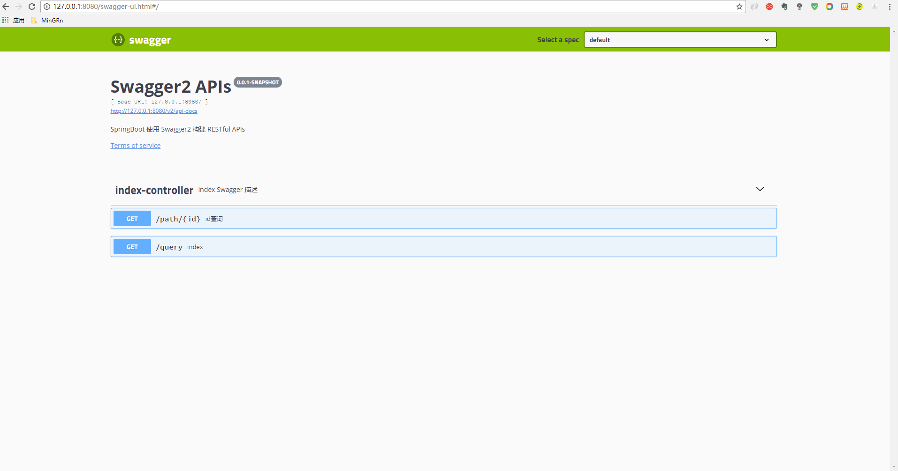

### SpringBoot 使用 Swagger 构建 RESTful 风格 Api

#### 为什么要使用 Swagger 构建 Api ？
> 由于Spring Boot能够快速开发、便捷部署等特性，相信有很大一部分Spring Boot
  的用户会用来构建RESTful API。而我们构建RESTful API的目的通常都是由于多终
  端的原因，这些终端会共用很多底层业务逻辑，因此我们会抽象出这样一层来同时服务于
  多个移动端或者Web前端。
>
> 这样一来，我们的RESTful API就有可能要面对多个开发人员或多个开发团队：IOS开
  发、Android开发或是Web开发等。为了减少与其他团队平时开发期间的频繁沟通成本，
  传统做法我们会创建一份RESTful API文档来记录所有接口细节，然而这样的做法有以
  下几个问题：
>
> - 由于接口众多，并且细节复杂（需要考虑不同的HTTP请求类型、HTTP头部信息、HTTP
    请求内容等），高质量地创建这份文档本身就是件非常吃力的事，下游的抱怨声不绝于
    耳。
> - 随着时间推移，不断修改接口实现的时候都必须同步修改接口文档，而文档与代码又处
  于两个不同的媒介，除非有严格的管理机制，不然很容易导致不一致现象。
>
> 为了解决上面这样的问题，本文将介绍RESTful API的重磅好伙伴Swagger2，它可以轻
  松的整合到Spring Boot中，并与Spring MVC程序配合组织出强大RESTful API文档。
  它既可以减少我们创建文档的工作量，同时说明内容又整合入实现代码中，让维护文档和修
  改代码整合为一体，可以让我们在修改代码逻辑的同时方便的修改文档说明。另外Swagger2
  也提供了强大的页面测试功能来调试每个RESTful API。
>
> 官方说法:
> Swagger是一个规范和完整的框架，用于生成、描述、调用和可视化 RESTful 风格的
  Web 服务。总体目标是使客户端和文件系统作为服务器以同样的速度来更新。文件的方法，
  参数和模型紧密集成到服务器端的代码，允许API来始终保持同步。

#### pom依赖
```xml
<!--swagger2-->
<dependency>
    <groupId>io.springfox</groupId>
    <artifactId>springfox-swagger2</artifactId>
    <version>2.8.0</version>
</dependency>
<dependency>
    <groupId>io.springfox</groupId>
    <artifactId>springfox-swagger-ui</artifactId>
    <version>2.8.0</version>
</dependency>
```

#### Swagger 效果图
> 

#### 创建 Swagger2 配置类
> 在 `Application.java` 同级创建 Swagger2 的配置类 Swagger2
```java
@Configuration
@EnableSwagger2
public class Swagger2 {

	@Bean
	public Docket createRestApi() {
		return new Docket(DocumentationType.SWAGGER_2)
				.apiInfo(apiInfo())
				.select()
				.apis(RequestHandlerSelectors.basePackage("com.mingrn.swagger.web"))
				.paths(PathSelectors.any())
				.build();
	}

	private ApiInfo apiInfo() {
		return new ApiInfoBuilder()
				.title("Swagger2 APIs")
				.description("SpringBoot 使用 Swagger2 构建 RESTful APIs")
				.termsOfServiceUrl("https://swagger.io/")
				.version("0.0.1-SNAPSHOT")
				.build();
	}
}
```
>
> 通过 `@Configuration` 注解，让 Spring 来加载该类配置。再通过 `@EnableSwagger2` 注解来启用
  Swagger2。
>
> 再通过 `createRestApi` 函数创建 Docket 的 Bean 之后，`apiInfo()` 用来创建该Api的基本信息（这些基本信息
  会展现在文档页面中）。`select()` 函数返回一个 ApiSelectorBuilder 实例用来控制哪些接口暴露给 Swagger
  来展现，本例采用指定扫描的包路径来定义，Swagger 会扫描该包下所有 Controller 定义的 API，并产生文档
  内容（除了被 `@ApiIgnore` 指定的请求）。

#### 注解详解
> 注解汇总

| 作用范围  |API    |使用位置   |
| :-------- | --------:| :--: |
| 对象属性  | @ApiModelProperty	 |  用在出入参数对象的字段上   |
| 协议集描述     |   @Api	 |  用于controller类上  |
| 协议描述      |    @ApiOperation | 用在controller的方法上 |
| Response集      |    @ApiResponses | 用在controller的方法上  |
| Response      |    @ApiResponse | 用在 @ApiResponses里边  |
| 非对象参数集      |    @ApiImplicitParams | 用在controller的方法上  |
| 非对象参数描述	      |    @ApiImplicitParam | 用在@ApiImplicitParams的方法里边  |
| 描述返回对象的意义	      |    @ApiModel | 用在返回对象类上  |
> @RequestMapping此注解的推荐配置 `value` `method` `produces`
>
```java
@ApiOperation("信息软删除")
@ApiResponses({
    @ApiResponse(code = CommonStatus.OK, message = "操作成功"),
    @ApiResponse(code = CommonStatus.EXCEPTION, message = "服务器内部异常"),
    @ApiResponse(code = CommonStatus.FORBIDDEN, message = "权限不足")
})
ApiImplicitParams({
    @ApiImplicitParam(paramType = "query", dataType = "Long", name = "id", value = "信息id", required = true)
})
@RequestMapping(value = "/remove.json", method = RequestMethod.GET, produces = MediaType.APPLICATION_JSON_UTF8_VALUE)
public RestfulProtocol remove(Long id) {
}
```

```java
@ApiModelProperty(value = "标题")
private String  title;
```

> @ApiImplicitParam 详解

|属性   |取值	    |作用   |
| :-------- | --------:| :--: |
|paramType   |	    |查询参数类型   |
|   |path	    |以地址的形式提交数据(eg: `@PathVariable`)   |
|   |query	    |直接跟参数完成自动映射赋值(eg: `@RequestParam`)   |
|   |body	    |以流的形式提交 仅支持POST(eg: `@RequestBody`)   |
|   |header	    |参数在request headers 里边提交(eg: `@RequestHeader`)   |
|   |form	    |以form表单的形式提交 仅支持POST   |
|dataType   |	    |参数的数据类型 只作为标志说明，并没有实际验证   |
|   |Long	    |以地址的形式提交数据   |
|   |String	    |以地址的形式提交数据   |
|   |int	    |以地址的形式提交数据   |
|   |boolean	    |以地址的形式提交数据   |
|   |float	    |以地址的形式提交数据   |
|   |double	    |以地址的形式提交数据   |
|   |decimal	    |以地址的形式提交数据   |
|   |date	    |以地址的形式提交数据   |
|   |datetime	    |以地址的形式提交数据   |
|name   |	    |接收参数名   |
|value   |	    |接收参数的意义描述   |
|required   |	    |参数是否必填   |
|defaultValue   |	    |默认值   |

#### `paramType` 示例详解
> path
>
```java
@RequestMapping(value = "/findById1/{id}", method = RequestMethod.GET, produces = MediaType.APPLICATION_JSON_UTF8_VALUE)

@PathVariable(name = "id") Long id
```
>
> body
>
```java
@ApiImplicitParams({
  @ApiImplicitParam(paramType = "body", dataType = "MessageParam", name = "param", value = "信息参数", required = true)
})
@RequestMapping(value = "/findById3", method = RequestMethod.POST, produces = MediaType.APPLICATION_JSON_UTF8_VALUE, consumes = MediaType.APPLICATION_JSON_VALUE)
@RequestBody MessageParam param

//提交的参数是这个对象的一个json，然后会自动解析到对应的字段上去，也可以通过流的形式接收当前的请求数据，但是这个和上面的接收方式仅能使用一个（用@RequestBody之后流就会关闭了）
```
>
> header
>
```java
@ApiImplicitParams({
  @ApiImplicitParam(paramType = "header", dataType = "Long", name = "id", value = "信息id", required = true)
})

String idstr = request.getHeader("id");
if (StringUtils.isNumeric(idstr)) {
    id = Long.parseLong(idstr);
}
```
>
> Form
>
```java
@ApiImplicitParams({
  @ApiImplicitParam(paramType = "form", dataType = "Long", name = "id", value = "信息id", required = true)
})
@RequestMapping(value = "/findById5", method = RequestMethod.POST, produces = MediaType.APPLICATION_JSON_UTF8_VALUE, consumes = MediaType.APPLICATION_FORM_URLENCODED_VALUE)
```
